# Eikensystem — System Workflow

## 1. ภาพรวมระบบ

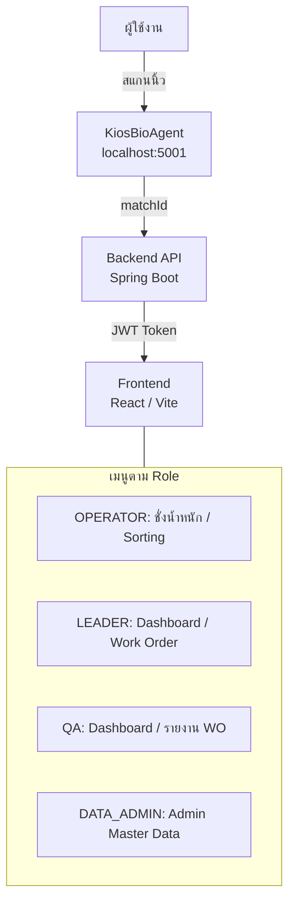

---

## 2. การ Login (ทุก User)

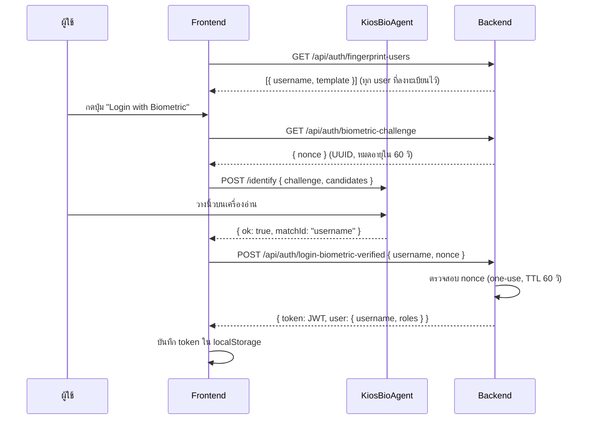

> **Fallback:** Login ด้วย Username + Password ยังใช้ได้ผ่าน `POST /api/auth/login`

---

## 3. Work Order Lifecycle (LEADER)

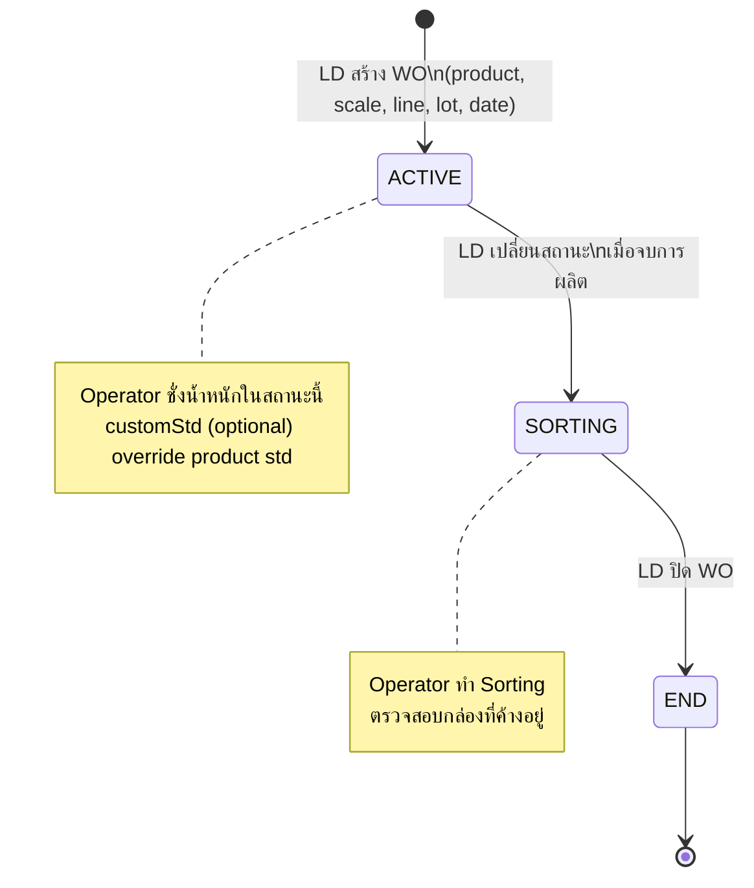

**LEADER สร้าง WO ระบุ:**
- Product + Scale + Line + Lot No.
- วันเริ่ม–สิ้นสุด
- `customStd` (ถ้าต้องการ override ค่า Std จาก master)
- DOUBLE mode: `customStd1`, `customStd2` แยกกัน

---

## 4. กระบวนการชั่งน้ำหนัก (OPERATOR)

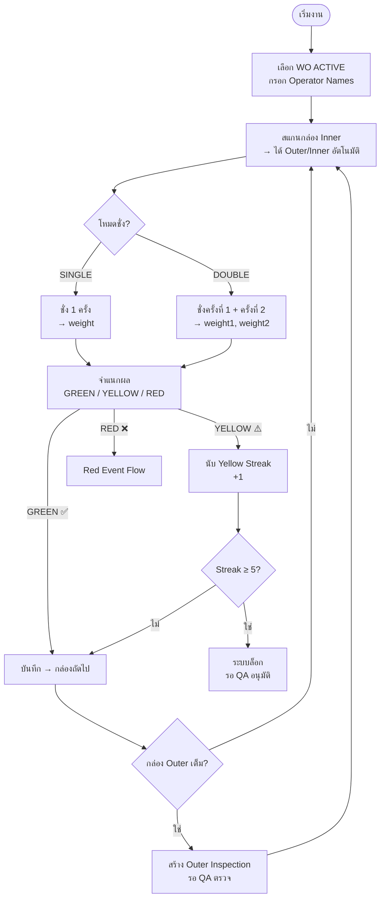

---

## 5. การจำแนกน้ำหนัก (Classification Logic)

```
ค่า Std ที่ใช้ (ลำดับความสำคัญ):
  1. Barrier record (ค่า Std ที่ QA Apply แล้ว)  ← สูงสุด
  2. WO customStd ที่ LD กำหนด
  3. Product.standardWeight
  4. weightPerPiece × quantityPerMeasurement (fallback)
```

```
❌ RED    : weight < Std − (weightPerPiece / 2)
            หรือ weight > Std + (weightPerPiece / 2)
⚠️ YELLOW : weight อยู่ใน half-piece range แต่ out-of-tolerance
             (Std − tolerance) > weight หรือ weight > (Std + tolerance)
✅ GREEN  : weight อยู่ใน Std ± tolerance
```

**DOUBLE mode**: จำแนก weight1 และ weight2 แยก → ถ้าอย่างใดอย่างหนึ่งแดงก็ RED

---

## 6. Red Event Flow (OPERATOR → LEADER)

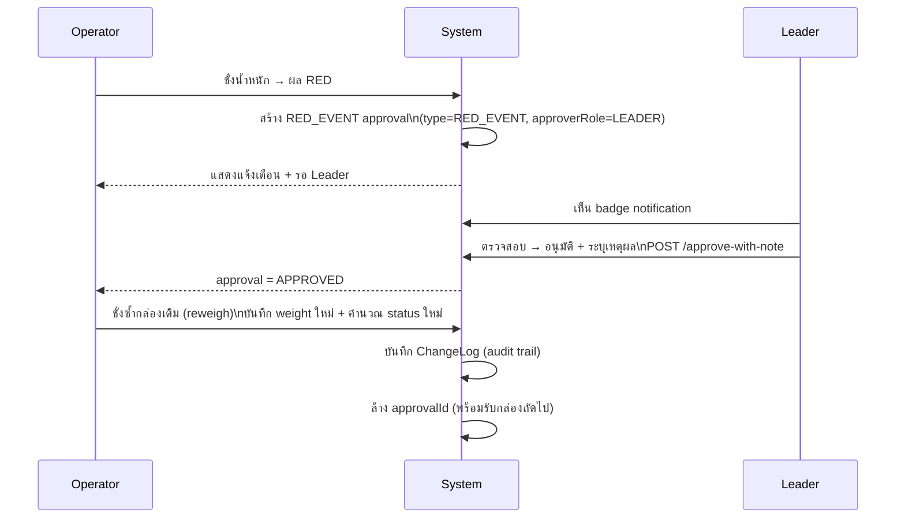

---

## 7. Yellow Streak & Standard Change Flow (OPERATOR → QA)

```mermaid
flowchart LR
    Y3[Yellow #3\nแสดงคำเตือน] --> Y4[Yellow #4]
    Y4 --> Y5[Yellow #5\n⚠️ ระบบล็อก]

    Y5 --> REQ[OP สร้าง STD_CHANGE_REQUEST\nstage = REQUESTED]
    REQ --> QA1[QA เห็นใน Dashboard]

    QA1 --> ALLOW[QA กด Allow 4&5\nstage = ALLOW_4_5]
    ALLOW --> BOX45[OP ชั่งกล่องที่ 4 และ 5\nรวบรวม 5 ค่า]
    BOX45 --> PROP[OP update-proposal\nส่ง weights5 + proposedStd\nstage = READY_FOR_APPLY]

    PROP --> QA2[QA ตรวจสอบ 5 ค่า\nคำนวณ Std ใหม่]
    QA2 --> APPLY[QA apply-std\nบันทึก StandardWeightLog]
    APPLY --> BARRIER[สร้าง Barrier Measurement\nouterBox=000, inner=RST1\nisForStandardAdjustment=true]
    BARRIER --> RESET[Yellow Streak ถูก reset\nOP ชั่งต่อได้ตามปกติ]
```

**Barrier Measurement** คือ record พิเศษที่ฝังใน timeline เพื่อ "ตัด" streak ที่นับจาก latest ย้อนหลัง

---

## 8. Initial Standard (10 กล่องแรก)

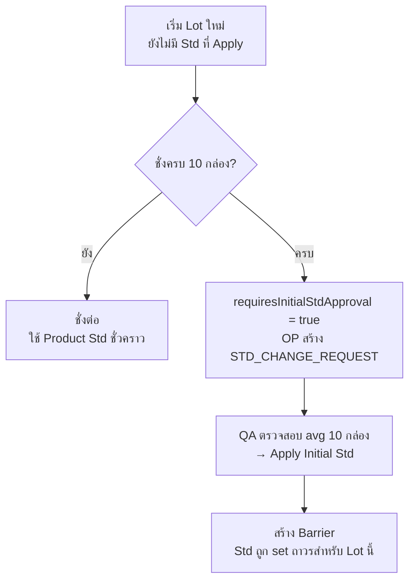

---

## 9. Cleaning Check Flow (OPERATOR → LEADER)

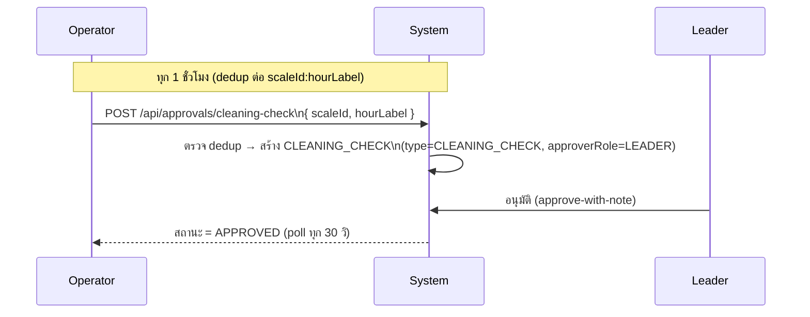

---

## 10. Outer Inspection Flow (OPERATOR → QA)

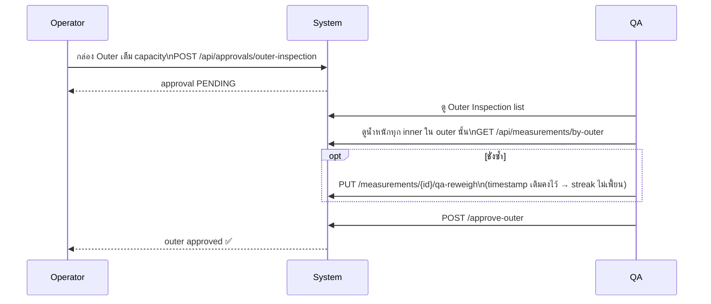

---

## 11. Sorting Flow (OPERATOR)

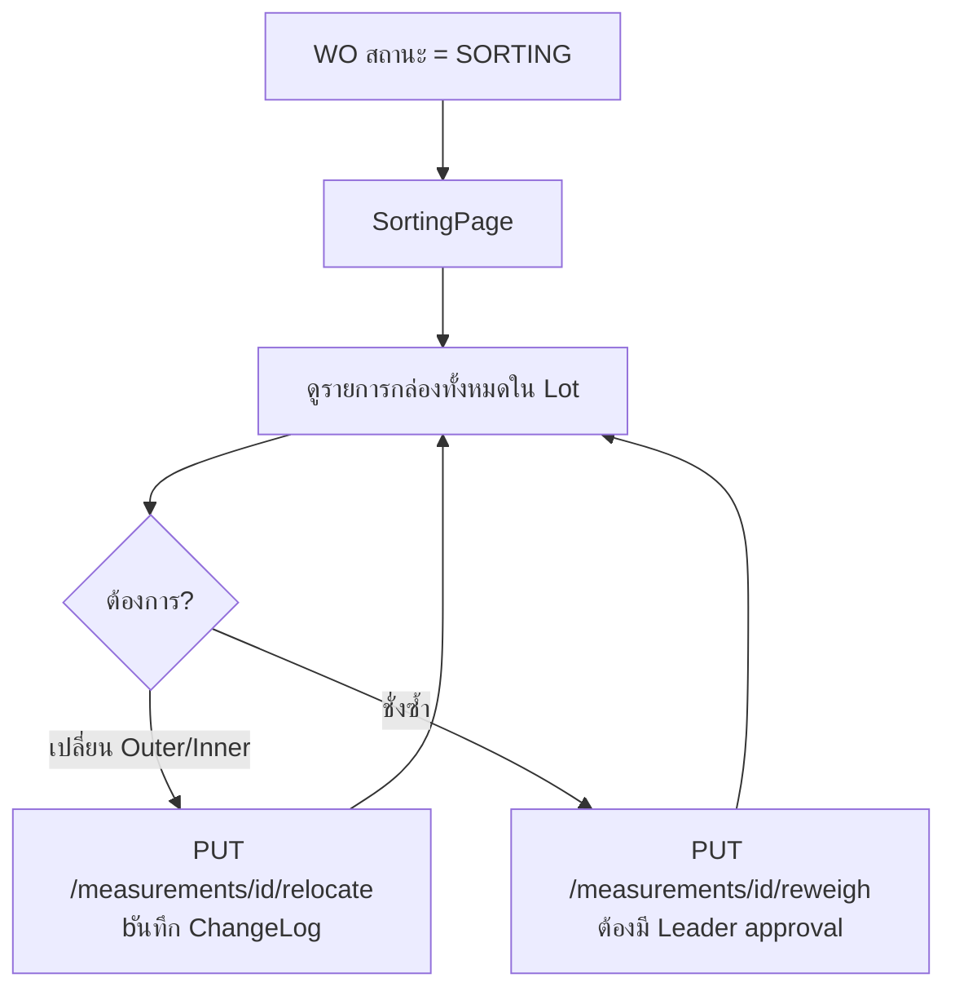

---

## 12. Reports (LEADER + QA)

| Tab | เนื้อหา |
|-----|---------|
| ภาพรวมทุก WO | Cross-WO performance: GREEN/YELLOW/RED count + pass rate ตาม date range |
| รายละเอียด WO | เลือก WO เดียว → tabs ด้านล่าง |
| — Lot Summary | สรุปจำนวน Measurement ต่อ Lot (GREEN/YELLOW/RED) |
| — Lot Details | รายการ measurement ทุก record ใน lot |
| — Lot Events | Timeline: STD changes + Approvals |
| — Operator Stats | สรุปจำนวนต่อ Operator |
| — รายงานประสิทธิภาพ | Pass rate ต่อคน + สรุปรายวัน-รายกะ |

---

## 13. Admin Functions (DATA_ADMIN / ADMIN)

| หมวด | ทำอะไรได้ |
|------|-----------|
| Users | สร้าง/แก้ Role/ลบ user, Reset password, ลงทะเบียนนิ้วแทน user |
| Products | เพิ่ม/แก้ Product: weightPerPiece, qty, tolerance, mode (SINGLE/DOUBLE), innerNumberingMode |
| Scales | เพิ่ม/แก้เครื่องชั่ง |
| Std Log | ดู history การ apply std |

---

## 14. การลงทะเบียนลายนิ้วมือ (ทุก User — Self-service)

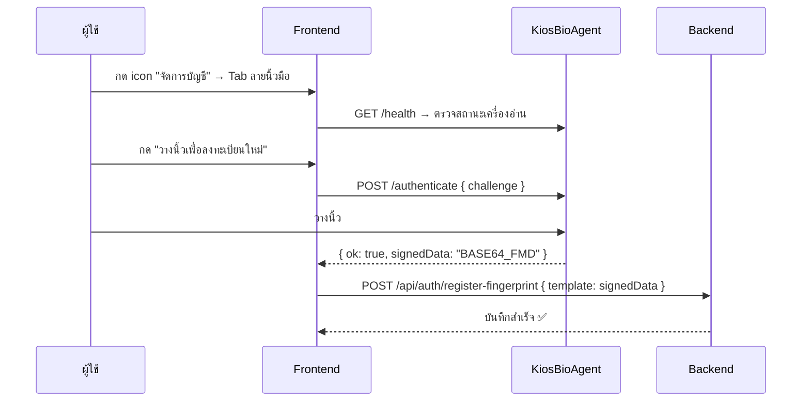

---

## 15. Approval Types Summary

| Type | Requester | Approver | Trigger |
|------|-----------|----------|---------|
| `RED_EVENT` | OPERATOR | LEADER | Measurement = RED |
| `STD_CHANGE_REQUEST` | OPERATOR | QA | Yellow streak ≥ 5 หรือ 10 กล่องแรก |
| `CLEANING_CHECK` | OPERATOR | LEADER | ทุก 1 ชั่วโมง ต่อเครื่องชั่ง |
| `OUTER_INSPECTION` | OPERATOR | QA | กล่อง Outer เต็ม |

---

## 16. Approval Stage (STD_CHANGE_REQUEST เท่านั้น)

```
REQUESTED → ALLOW_4_5 → READY_FOR_APPLY → APPLIED
    ↑ QA allow    ↑ OP update-proposal    ↑ QA apply-std
```

---

## 17. Operation Flow — ก่อนเริ่มกะ (Pre-shift)

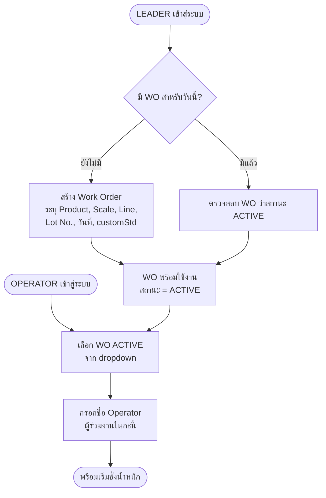

---

## 18. Operation Flow — การชั่งน้ำหนักปกติ (Normal Weighing)

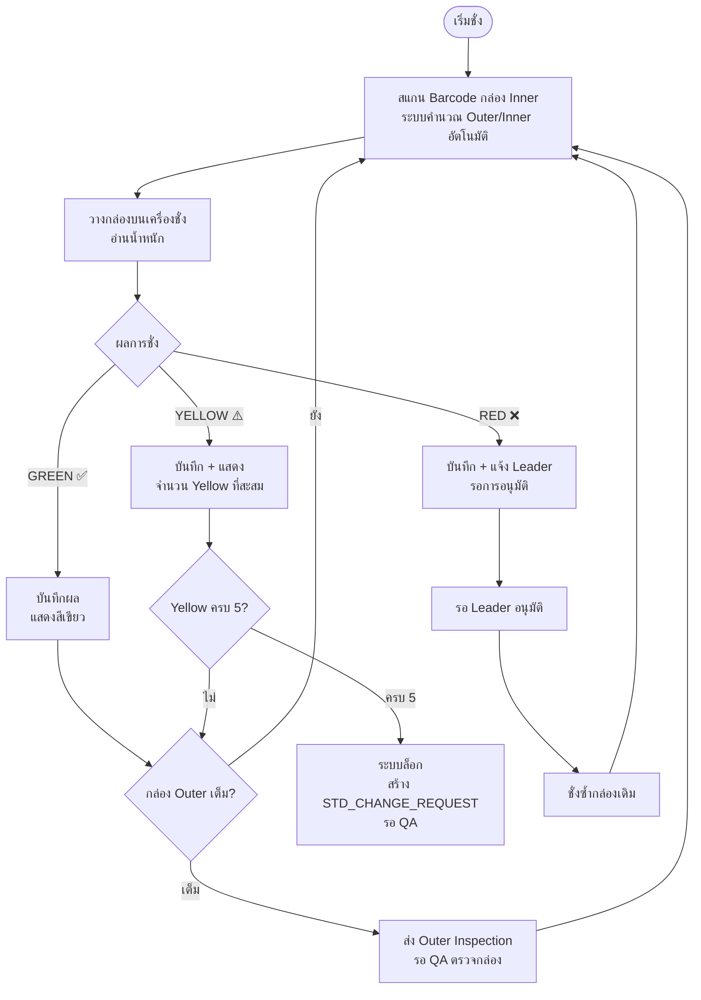

---

## 19. Operation Flow — Cleaning Check (ทุก 1 ชั่วโมง)

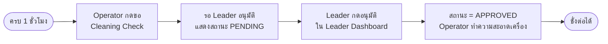

---

## 20. Operation Flow — Red Event (กล่อง RED)

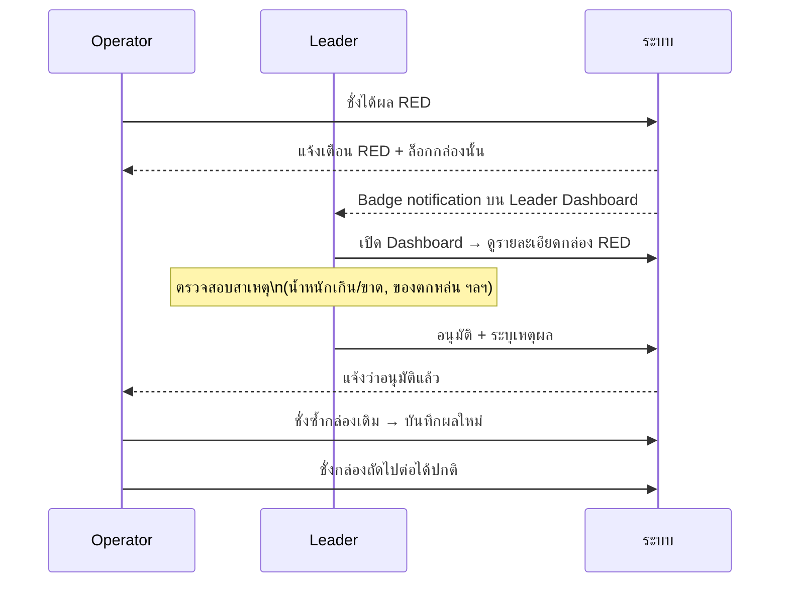

---

## 21. Operation Flow — Yellow Streak (5 กล่องเหลือง)

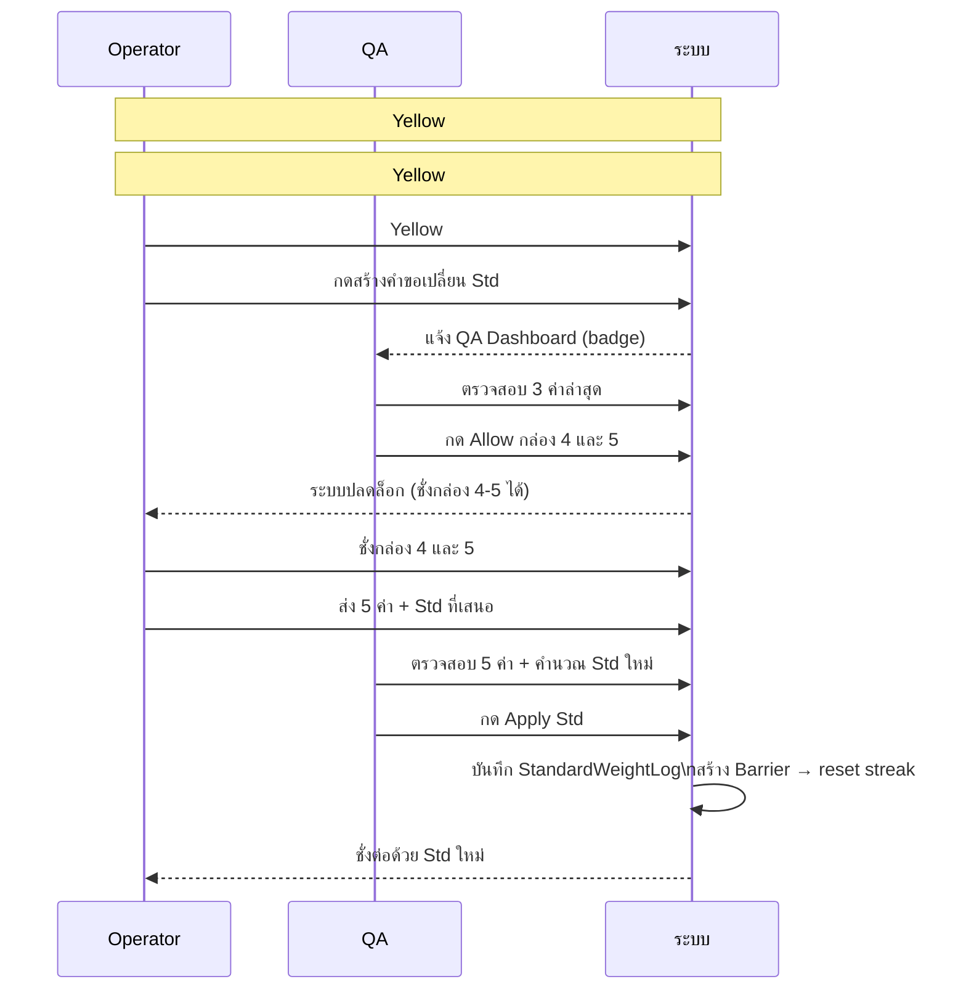

---

## 22. Operation Flow — Outer Box Inspection (QA ตรวจกล่อง)

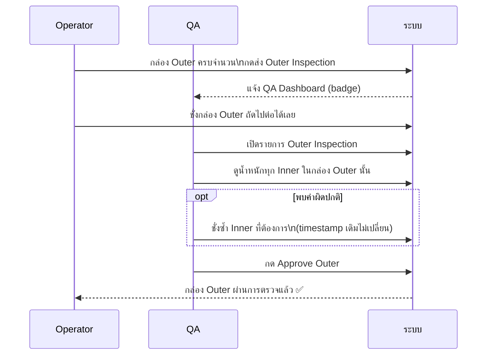

---

## 23. Operation Flow — จบการผลิต (End of Production)

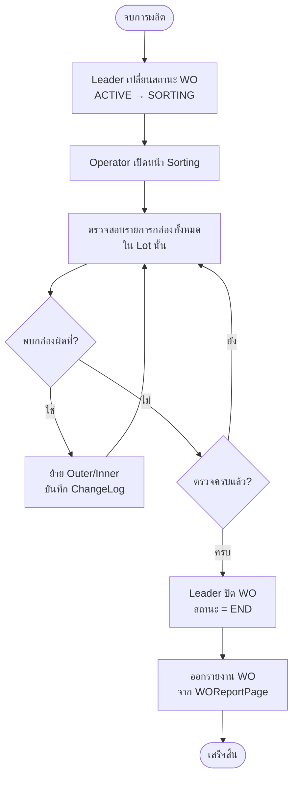

---

## 24. Operation Flow — ภาพรวมทั้งกะ (Full Shift Overview)

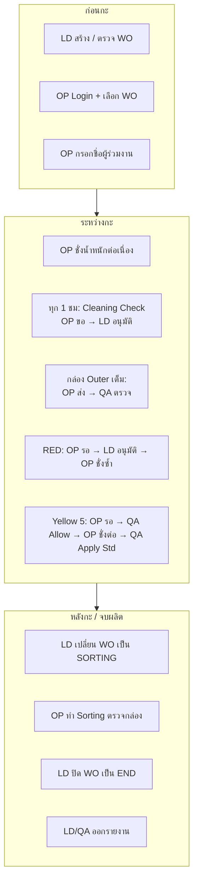
